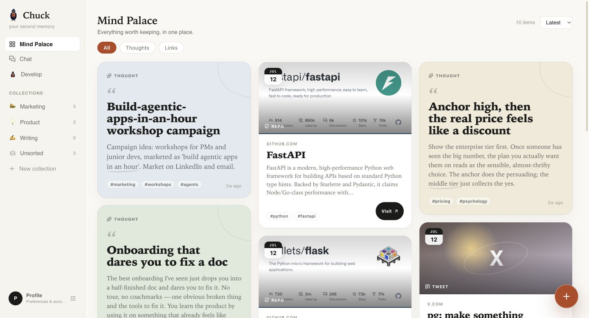
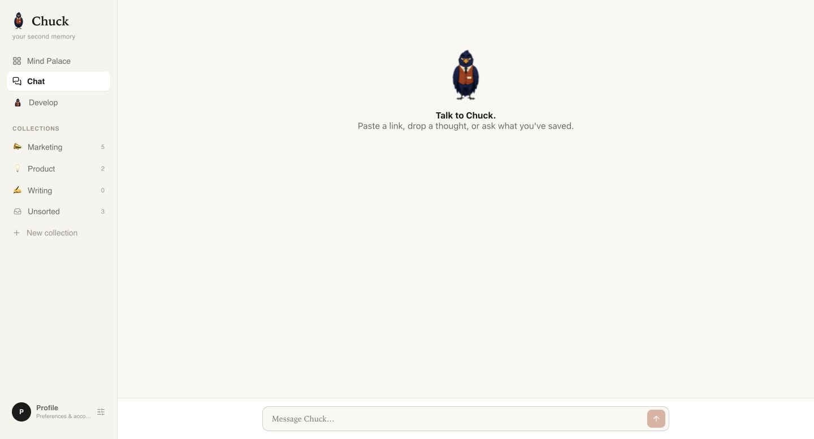
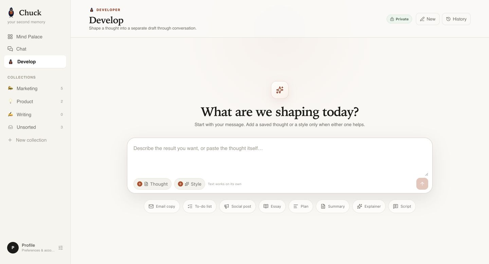
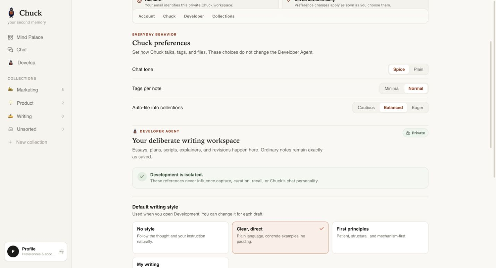
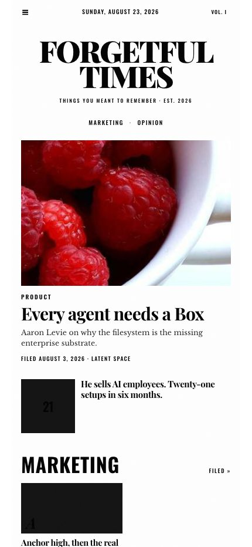

<p align="center">
  <a href="./docs/chuck-repo-video.mp4">
    
  </a>
</p>


<h1 align="center">Chuck</h1>

<p align="center">
  <strong>Your second memory. With none of the filing.</strong>
</p>

<p align="center">
  Throw Chuck a thought, link, repo, or half-formed idea.<br />
  It lands now, organises itself in the background, and comes back when you ask —
  <br />and every Sunday, without asking, as a paper worth actually reading.
</p>

<p align="center">
  <a href="https://lemma.work/import/github/wineforyourplate/chuck">
    
  </a>
</p>


<p align="center">
  
</p>

<p align="center">
  <a href="https://chuck.apps.asur.work">Live app</a>
  ·
  <a href="#see-chuck-in-action">Watch the demo</a>
  ·
  <a href="#how-chuck-works">Explore the pod</a>
  ·
  <a href="#make-chuck-yours">Remix it</a>
</p>

---

## See Chuck in action


## One memory. Every front door.

Capture a thought where it finds you. Recall it from the conversation you are
already in. Open the full app when you want to browse the Mind Palace or develop
the idea further.

<table>
  <tr>
    <td align="center" width="14%">
      
      <br /><sub><strong>Web app</strong></sub>
    </td>
    <td align="center" width="14%">
      
      <br /><sub><strong>Telegram</strong></sub>
    </td>
    <td align="center" width="14%">
      
      <br /><sub><strong>WhatsApp</strong></sub>
    </td>
    <td align="center" width="14%">
      
      <br /><sub><strong>Slack</strong></sub>
    </td>
    <td align="center" width="14%">
      
      <br /><sub><strong>Teams</strong></sub>
    </td>
    <td align="center" width="14%">
      
      <br /><sub><strong>Gmail</strong></sub>
    </td>
    <td align="center" width="14%">
      
      <br /><sub><strong>Outlook</strong></sub>
    </td>
  </tr>
</table>

<p align="center">
  <sub>The web app ships with Chuck. Messaging and email surfaces are connected per deployment.</sub>
</p>

## Save first. Sort later.

Most note apps ask you to organise a thought before you have finished having it:
pick a folder, write a title, add tags, decide what it means.

Chuck separates capture from organisation.

1. **Capture instantly.** Your words are saved before your attention moves on.
2. **Curate quietly.** A background agent reads, titles, tags, and files the note.
3. **Ask your memory.** Chuck answers from what you actually kept and points back to it.
4. **Develop deliberately.** Turn a fragment into an email, plan, essay, script, or
   another useful draft without overwriting the source.
5. **Read weekly, unprompted.** Every Sunday, an Editor agent lays out what you saved
   that week as *Forgetful Times* — a real front page with a hero story, a rail of
   pulled highlights, sections by collection, and one closing thought. Headlines are
   real hyperlinks. You tap through and read the actual thing.

## One memory, several ways back in

<table>
  <tr>
    <td width="50%">
      
      <br /><strong>Mind Palace</strong><br />
      A calm, visual home for thoughts, links, repos, articles, and collections.
    </td>
    <td width="50%">
      
      <br /><strong>Ask what you already knew</strong><br />
      Recall saved material naturally, with supporting notes you can reopen.
    </td>
  </tr>
  <tr>
    <td width="50%">
      
      <br /><strong>Develop without destroying</strong><br />
      A separate Developer Agent turns a source into a private draft.
    </td>
    <td width="50%">
      
      <br /><strong>Make it sound and file like you</strong><br />
      Tune tone, tags, filing confidence, styles, references, and collection rules.
    </td>
  </tr>
  <tr>
    <td width="50%">
      
      <br /><strong>Forgetful Times, every Sunday</strong><br />
      A real front page rendered from that week's notes — hero, rail, sections,
      opinion — with headlines that are real hyperlinks, not a screenshot of one.
    </td>
    <td width="50%" valign="top">
      <br /><strong>Read it in the app, too</strong><br />
      The Editorial tab lists every past edition and renders the one you pick —
      the newspaper keeps its own typography inside the app's own UI.
    </td>
  </tr>
</table>

## Private before clever

- Notes, collections, preferences, and drafts use row-level security.
- Every member sees only their own records.
- Personal writing references and developed documents live under that member's `/me`.
- The Developer Agent can read a selected source note but cannot change it.
- Agents and functions receive only the named resources they need.
- Pages and uploaded documents are treated as untrusted reference material.
- The public repository contains no personal notes, records, credentials, tokens, or
  connector accounts.

## Install and Remix 🪄

<p>
  <a href="https://lemma.work/import/github/wineforyourplate/chuck">
    
  </a>
</p>

The button opens Lemma's import flow for this exact repository:

```text
https://lemma.work/import/github/wineforyourplate/chuck
```

After import, run the included bootstrap script once to upload Chuck's public
playbooks and writing styles:

```bash
bash scripts/bootstrap-files.sh --pod <pod-id>
```

Then open `chuck-app`, save one real thought, and watch its raw card settle into a
titled and tagged memory.

<details>
<summary><strong>Install from the command line</strong></summary>

You need an authenticated Lemma CLI, Node.js 20.19+ with npm, and `jq`.

```bash
git clone https://github.com/wineforyourplate/chuck.git
cd chuck

lemma pods create chuck --org <org-id>
lemma --pod <pod-id> pods import . --dry-run

VITE_LEMMA_API_URL="https://api.<your-lemma-host>" \
VITE_LEMMA_AUTH_URL="https://<your-lemma-host>/auth" \
VITE_LEMMA_POD_ID="<pod-id>" \
lemma --pod <pod-id> pods import .

bash scripts/bootstrap-files.sh --pod <pod-id>
lemma --pod <pod-id> apps open chuck-app
```

</details>

### Optional front doors

Connect Telegram in the target organisation and point its surface at the `chuck`
agent. Connector accounts are environment-specific and intentionally do not travel
with a public repository.

New pod members receive their own personal curator schedule when they first open the
app. Add working members with the `USER` role or higher; a read-only `VIEWER` cannot
save thoughts or create automation.

The weekly edition doesn't get that same per-member treatment yet: `weekly-edition`
is a single schedule imported with the bundle, owned by whoever ran the import, and
the Editor reads across the pod rather than per-caller RLS. Fine for the single-owner
pod this ships as; a fork going multi-member should give each member their own
edition schedule the same way `curate-on-save` already does. `/editions` itself is
folder-level permissions, not row-level RLS — anyone with folder access sees every
edition, not just their own week.

## How Chuck works

```text
you save a thought or link
            │
            ▼
      private notes row ───────────────▶ appears immediately
            │ INSERT
            ▼
   personal curator schedule
            │
            ▼
      Curator Agent ── fetches a public link when present
            │        ── creates title, tags, kind, and collection
            │        ── writes searchable long-form memory
            ▼
       the same card updates
            │
       ┌────┴─────────┐
       ▼              ▼
 ask Chuck      develop a separate draft

 ── every Sunday, on a clock, independent of the above ──

  weekly-edition schedule (TIME)
            │
            ▼
      Editor Agent ── pulls the last 7 days of filed notes
            │        ── scores and picks a hero, a rail, sections, one opinion
            │        ── emits JSON only, never HTML
            ▼
      render_edition ── deterministic function: validates, escapes, downgrades
            │            the layout if the data can't support what was asked
            ▼
   /editions/<year>-W<week>.html ──▶ one notification, a real link, not an image
```

This repository is the complete Lemma pod, not merely an app screenshot or prompt:

| Layer | What ships |
| --- | --- |
| App | Mind Palace, chat, note editor, collections, settings, Development workspace, and an Editorial tab that renders past editions |
| Agents | `chuck` for capture/recall, `curator` for background filing, `developer` for deliberate transformation, `editor` for the weekly edition |
| Tables | Private notes, collections, preferences, drafts, and editions |
| Functions | A safe public URL reader, a portable file-bootstrap utility, and a deterministic HTML renderer for the weekly edition |
| Automation | An INSERT-only personal schedule that wakes the curator without trigger loops, plus a weekly TIME schedule that wakes the editor |
| Files | Public playbooks, style templates, and the edition template, plus private runtime paths for each member |

The important design choice is simple: **capture stays fast because filing happens
afterward.** The note itself is durable state; the agents are replaceable workers
around it.

## Make Chuck yours

1. [Fork this repository](https://github.com/wineforyourplate/chuck/fork).
2. Change the agent instructions, filing rules, app, tables, or writing styles.
3. Import your fork at
   `https://lemma.work/import/github/<your-github-name>/<your-repo>`.
4. Keep private records, connector accounts, member IDs, and credentials out of Git.

Useful places to start:

- `agents/chuck/instruction.md` — capture and recall behaviour.
- `agents/curator/instruction.md` — background filing behaviour.
- `agents/developer/instruction.md` — transformation and source-safety rules.
- `agents/editor/instruction.md` and `files/playbook/edit-edition.md` — weekly
  edition selection rules (hero scoring, dek rules, what gets skipped).
- `files/templates/forgetful-times.html` — the edition's design. The agent never
  touches this; `functions/render_edition` is the only thing that renders it.
- `files/playbook/` — procedures the agents load on demand.
- `files/voices/` — reusable writing styles.
- `apps/chuck-app/source/` — the complete React app.
- `DESIGN.md` — architecture, access states, and trust boundaries.

## Verify your remix

```bash
cd apps/chuck-app/source
npm ci
npm test
npm run build

cd ../../..
lemma --pod <pod-id> pods import . --dry-run
lemma --pod <pod-id> pods doctor chuck
```

For retrieval evaluation against representative notes, see
[`evals/README.md`](./evals/README.md).

## Share Chuck

<p>
  <a href="https://twitter.com/intent/tweet?text=Chuck%3A%20your%20second%20memory%2C%20with%20none%20of%20the%20filing.&amp;url=https%3A%2F%2Fgithub.com%2Fwineforyourplate%2Fchuck">
    
  </a>
  <a href="https://www.linkedin.com/sharing/share-offsite/?url=https%3A%2F%2Fgithub.com%2Fwineforyourplate%2Fchuck">
    
  </a>
</p>

---

<p align="center">
  <strong>Save the thought. Chuck handles the filing.</strong>
</p>
